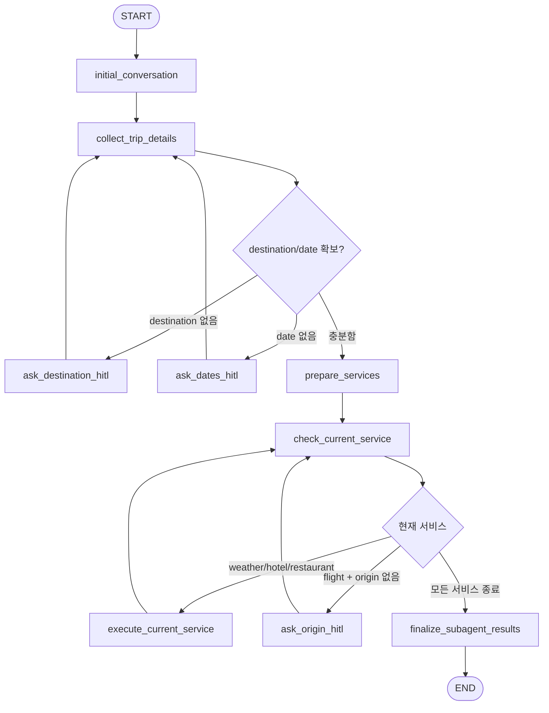

# Travel Agent

LangGraph 기반 여행 상담 데모입니다. 현재 구현은 하나의 supervisor 그래프가 대화에서 여행 정보를 추출하고, 필요한 시점에 Human-in-the-loop(HITL) 질문을 던진 뒤, 4개의 서브 에이전트를 순차적으로 실행하는 구조입니다.

현재 코드 기준 핵심 특징:

- 실행 UI는 Gradio 챗봇입니다.
- 실제 앱이 사용하는 supervisor는 `src/travel_agent/supervisor/chapter_graph.py`입니다.
- 서브 에이전트 실행 순서는 고정입니다: `weather -> hotel -> flight -> restaurant`
- 항공은 SerpApi Google Flights 실조회 경로가 연결되어 있습니다.
- 날씨는 OpenWeather 실조회 경로가 연결되어 있습니다.
- 호텔은 `SERPAPI_API_KEY`가 있으면 실 API를 사용하고, 없으면 더미 추천으로 fallback 합니다.
- 맛집은 현재 더미 추천 데이터를 사용합니다.
- `flight` 단계에서 출발지가 없으면 그 시점에만 HITL로 추가 질문합니다.
- 로그는 `travel_agent.langgraph` 스트림 로그만 기본 출력되도록 정리되어 있습니다.

## 현재 구조

### 활성 실행 경로

실제로 앱이 사용하는 경로는 아래와 같습니다.

1. `src/travel_agent/app.py`
2. `src/travel_agent/service.py`
3. `src/travel_agent/supervisor/__init__.py`
4. `src/travel_agent/supervisor/chapter_graph.py`

즉, `supervisor/graph.py`는 저장소 안에 남아 있지만 현재 앱의 활성 supervisor는 아닙니다. 현재 UI와 서비스 호출은 모두 `chapter_graph.py`를 사용합니다.

### 서브 에이전트 상태

| 도메인 | 현재 구현 | 비고 |
|---|---|---|
| `weather` | 실 API + LLM 요약 | OpenWeather + OpenAI |
| `hotel` | 조건부 실 API | `SERPAPI_API_KEY`가 있으면 SerpApi Hotels, 없으면 더미 데이터 |
| `flight` | 실 API | SerpApi Google Flights |
| `restaurant` | 더미 데이터 | 지역별 샘플 맛집 목록 |

### 주요 파일

| 파일 | 역할 |
|---|---|
| `src/travel_agent/app.py` | Gradio UI, 대화창과 요약 패널 구성 |
| `src/travel_agent/service.py` | 한 턴 실행, `thread_id` 유지, HITL resume 처리 |
| `src/travel_agent/config.py` | 루트 `.env` 로드, API 키, 로깅 설정 |
| `src/travel_agent/graph_stream.py` | LangGraph `stream()` 이벤트 요약 로그 |
| `src/travel_agent/state.py` | supervisor 상태 스키마 |
| `src/travel_agent/slots.py` | 필수 슬롯과 서비스 순서 |
| `src/travel_agent/supervisor/chapter_graph.py` | 현재 실제 실행되는 supervisor 그래프 |
| `src/travel_agent/agents/flight/agent.py` | 항공 실조회, 공항 코드 변환, LLM fallback |
| `src/travel_agent/agents/weather/agent.py` | 날씨 에이전트 오케스트레이션 |
| `src/travel_agent/agents/weather/tools.py` | OpenWeather API 호출 |

## 실행 흐름

현재 supervisor의 흐름은 아래와 같습니다.



### 단계 설명

#### 1. `initial_conversation`

- 첫 assistant 안내 문구를 추가합니다.
- 사용자가 보기에 "여행지와 날짜 확인 후 순서대로 정리한다"는 시작 메시지를 제공합니다.

#### 2. `collect_trip_details`

- 현재 대화 전체를 기반으로 LLM이 아래 슬롯을 추출합니다.
  - `destination`
  - `start_date`
  - `end_date`
  - `origin`
- 이미 채워진 값이 있으면 유지하고, 더 명확한 값이 있으면 보완합니다.

#### 3. 필수 정보 HITL

- 여행지가 없으면 `ask_destination_hitl`
- 날짜가 없으면 `ask_dates_hitl`
- 둘 다 있으면 서비스 실행 단계로 넘어갑니다.

#### 4. 서비스 준비

- `slots.py`의 `SERVICE_ORDER`를 그대로 고정 사용합니다.
- 현재 기본 순서는 `["weather", "hotel", "flight", "restaurant"]` 입니다.
- 상태에는 `current_service_index`가 들어가며, 현재 어느 서비스까지 실행됐는지 추적합니다.

#### 5. 순차 서브 에이전트 실행

- 한 번에 하나의 서브 에이전트만 실행합니다.
- `weather` 실행
- `hotel` 실행
- `flight` 실행
- `restaurant` 실행

#### 6. `flight` 전용 HITL

- `flight` 차례가 왔는데 `origin`이 비어 있으면 그 시점에만 `ask_origin_hitl`이 발생합니다.
- 즉, 초기 슬롯 수집 단계에서 미리 출발지를 강제하지 않습니다.
- 이 구조 덕분에 향후 다른 서브 에이전트도 자기 차례에 필요한 정보를 추가로 HITL로 요청할 수 있습니다.

#### 7. 결과 합치기

- 각 서브 에이전트 결과를 `sub_results`에 저장합니다.
- 마지막에 `finalize_subagent_results`에서 사용자용 응답 하나로 합칩니다.

## 서브 에이전트 상세

### Weather

파일:

- `src/travel_agent/agents/weather/agent.py`
- `src/travel_agent/agents/weather/tools.py`

동작:

- `OPENAI_API_KEY`와 `OPENWEATHER_API_KEY`가 모두 있으면
  - OpenWeather tool 호출이 가능한 LangChain agent를 만들고
  - 결과를 한국어 여행용 요약으로 반환합니다.
- LLM 경로가 실패하면
  - `get_current_weather`
  - `get_weather_forecast`
  직접 호출 결과를 합쳐 반환합니다.

주의:

- 런타임 코드는 루트 `.env`의 `OPENWEATHER_API_KEY`를 사용합니다.
- `agents/weather` 폴더 내부의 별도 `.env`를 읽지 않습니다.

### Flight

파일:

- `src/travel_agent/agents/flight/agent.py`
- `src/travel_agent/agents/flight/flight_api_client.py`
- `src/travel_agent/agents/flight/graph.py`

동작:

- `flight_serpapi_api_key`가 있으면 SerpApi Google Flights를 호출합니다.
- 위치 문자열은 아래 순서로 공항 코드로 바꿉니다.
  1. 하드코딩 alias 매핑
  2. 묶음 IATA 코드 보정 (`SEL -> ICN`, `TYO -> NRT` 등)
  3. LLM fallback
- 변환이 끝난 뒤 `departure_id`, `arrival_id`, `outbound_date`, `return_date`, `type`으로 SerpApi를 호출합니다.
- 결과는 상위 항공권 몇 개를 한국어 문장으로 포맷합니다.

출발지 처리:

- supervisor 흐름에서는 `flight` 차례에만 출발지를 요구합니다.
- standalone `flight` subgraph(`agents/flight/graph.py`)도 동일하게 origin HITL을 지원합니다.

### Hotel

파일:

- `src/travel_agent/agents/hotel/agent.py`

동작:

- `SERPAPI_API_KEY`가 있으면 SerpApi Hotels 결과를 반환합니다.
- 키가 없으면 지역별 샘플 숙소 목록으로 fallback 합니다.

### Restaurant

파일:

- `src/travel_agent/agents/restaurant/agent.py`

동작:

- 현재는 지역별 샘플 맛집 목록을 반환합니다.
- 지도/검색 API 연동은 아직 없습니다.

## 상태 모델

`src/travel_agent/state.py`의 `SupervisorState`는 현재 아래 필드를 사용합니다.

| 필드 | 의미 |
|---|---|
| `messages` | user/assistant 대화 기록 |
| `slots` | 실행할 서비스 목록 |
| `current_service_index` | 현재 실행 중인 서비스 인덱스 |
| `proposed_slots` | 현재 active graph에서는 거의 사용하지 않음 |
| `slot_values` | 추출된 슬롯 값 |
| `current_phase` | 현재 그래프 단계 |
| `sub_results` | 도메인별 결과 문자열 |

## 설정

### 의존성 설치

```bash
uv sync
```

### 환경 변수

루트 `.env`를 사용합니다. `src/travel_agent/config.py`가 프로젝트 루트의 `.env`를 명시적으로 읽습니다.

`.env.example` 기준 주요 변수:

| 변수 | 설명 |
|---|---|
| `OPENAI_API_KEY` | OpenAI API 키 |
| `OPENAI_MODEL` | 기본 모델, 현재 기본값은 `gpt-4o-mini` |
| `OPENWEATHER_API_KEY` | OpenWeather API 키 |
| `SERPAPI_API_KEY` | SerpApi 공용 API 키 (hotel/flight 공용 가능) |
| `flight_serpapi_api_key` | 항공 경로 하위 호환용 SerpApi API 키 |
| `TRAVEL_AGENT_LOG_LEVEL` | 루트 로그 레벨, 기본 `WARNING` |
| `TRAVEL_AGENT_LANGGRAPH_LOG_LEVEL` | LangGraph stream 로그 레벨, 기본 `INFO` |
| `TRAVEL_AGENT_LOG_PREVIEW` | 로그 미리보기 길이, 기본 `240` |

중요:

- 현재 런타임은 루트 `.env`만 사용합니다.
- `src/travel_agent/agents/flight/.env` 같은 내부 파일은 활성 경로에서 사용하지 않습니다.

## 실행

### Gradio UI

```bash
uv run python -m travel_agent.app
```

또는

```bash
uv run python -m travel_agent
```

현재 `src/travel_agent/__main__.py`는 `travel_agent.app`의 `main()`을 호출하므로 두 명령 모두 Gradio UI를 띄웁니다.

### 사용 예시

첫 입력:

```text
도쿄로 2026-05-01부터 2026-05-03까지 여행 가고 싶어요.
```

예상 흐름:

1. destination/date 추출
2. weather 실행
3. hotel 실행
4. flight 차례에서 origin이 없으면 출발지 질문
5. `서울` 입력
6. flight 실행
7. restaurant 실행
8. 최종 응답 반환

## 로깅

현재 로그는 기본적으로 `travel_agent.langgraph`만 출력합니다.

의도:

- 외부 라이브러리 로그 노이즈 제거
- LangGraph 노드 진행 상황만 짧게 확인

기본 형식:

```text
18:12:04 [LG update] ns=supervisor node=collect_trip_details phase=collecting_trip_info slot_values[destination="도쿄", start_date="2026-05-01", end_date="2026-05-03"]
18:12:04 [LG wait] thread=... phase=running_subagents service_index=2 slots=[weather, hotel, flight, restaurant] ... interrupts=origin
18:12:10 [LG done] thread=... phase=completed ...
```

레벨별 동작:

- `INFO`
  - `updates`
  - 최종 `wait/done`
- `DEBUG`
  - 위 항목 +
  - task 시작/결과
  - values 요약

## 테스트

현재 주요 테스트 파일:

| 파일 | 검증 내용 |
|---|---|
| `tests/test_flight_integration.py` | 항공 공항코드 변환, LLM fallback, flight graph interrupt/resume |
| `tests/test_weather_integration.py` | OpenWeather tool 호출과 weather agent fallback |
| `tests/test_service_flow.py` | supervisor 순차 실행, origin HITL resume |
| `tests/test_graph_stream.py` | 스트림 로그 요약과 debug mode 제어 |

전체 테스트 예시:

```bash
uv run python -m unittest tests.test_graph_stream tests.test_service_flow tests.test_flight_integration tests.test_weather_integration
```

## 현재 제한 사항

- `hotel`은 `SERPAPI_API_KEY`가 있으면 실 API를 사용하고, 없으면 더미 데이터로 fallback 합니다.
- `restaurant`는 아직 실 API가 아닙니다.
- `weather`는 코드 경로는 실 API지만, 실제 `.env` 키가 유효해야만 정상 응답합니다.
- `flight` 위치 변환은 하드코딩 alias + LLM fallback 구조라서, 완전한 공항 검색 엔진은 아닙니다.
- `supervisor/graph.py`는 저장소에 남아 있지만 현재 앱 실행 경로에는 사용되지 않습니다.

## 개발 메모

현재 구조에서 확장할 때의 권장 방향:

- 새로운 서비스별 HITL이 필요하면 `chapter_graph.py`의 `route_current_service()`에서 서비스별 분기를 추가합니다.
- 더미 도메인을 실 API로 바꿀 때는 `agents/<domain>/agent.py`를 먼저 바꾸고, supervisor는 호출 순서와 HITL만 유지합니다.
- 문서화된 변경 이력은 [CHANGES_FROM_GIT_BASE.md](./CHANGES_FROM_GIT_BASE.md)를 참고하세요.
