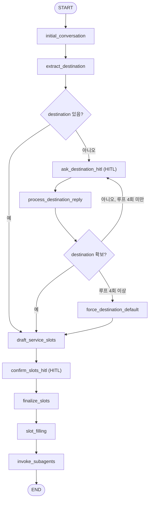

# Travel Agent

LangGraph 기반 멀티에이전트 여행 플래너입니다. **슈퍼바이저** 하나가 대화·슬롯·HITL을 맡고, 확정된 서비스만큼 **서브 에이전트**(날씨·호텔·항공·맛집)를 순차 호출합니다. 체크포인터는 `InMemorySaver`, 사람 개입은 `interrupt()` + `Command(resume=…)` 로 이어집니다.

## 에이전트 프로세스 (상세)

### 한눈에 보는 흐름

슈퍼바이저 그래프는 아래 순서로 노드가 실행됩니다. 다이어그램에서 `(HITL)`이 붙은 노드는 사용자 입력이 필요한 **Human-in-the-loop** 구간입니다.



### 단계별 동작

1. **`initial_conversation`**  
   - 사용자 메시지가 있으면 LLM이 여행 플래너 톤으로 한 번 응답해 `messages`에 assistant 발화를 추가합니다.  
   - `current_phase`는 `initial`로 둡니다.

2. **`extract_destination`**  
   - 지금까지의 `messages`만 보고 LLM이 JSON으로 **목적지**를 추출합니다.  
   - 성공 시 `slot_values["destination"]`에 넣고, `destination_loop_count`를 0으로 맞춥니다.

3. **여행지 분기 (`route_has_destination`)**  
   - `destination`이 비어 있으면 → **`ask_destination_hitl`**  
   - 채워져 있으면 → **`draft_service_slots`** 로 건너뜁니다.

4. **HITL ① `ask_destination_hitl`**  
   - `interrupt()`로 그래프가 멈추고, UI/CLI에는 “여행지를 알려 달라 / **추천** 입력” 안내가 나갑니다.  
   - 사용자가 답하면 `Command(resume=…)`으로 같은 `thread_id`에서 재개합니다.  
   - 재개 후 사용자 문장이 `messages`에 user로 붙습니다.

5. **`process_destination_reply`**  
   - 마지막 user 메시지를 해석합니다.  
   - **「추천」** 등이면 LLM이 대화 맥락으로 도시 하나를 골라 `destination`과 assistant 설명을 채웁니다.  
   - 그 외에는 지명 추출 JSON으로 `destination`을 채우거나, 불명확하면 assistant가 다시 안내합니다.

6. **재분기 (`route_after_destination`)**  
   - `destination`이 있으면 → `draft_service_slots`  
   - 없고 HITL 루프가 **4회 미만**이면 → 다시 `ask_destination_hitl`  
   - 없고 **4회 이상**이면 → **`force_destination_default`**: 데모용으로 `destination`을 **서울**로 두고 진행한다는 안내를 남깁니다.

7. **`draft_service_slots`**  
   - 대화만 보고 LLM이 `proposed_slots` 배열을 제안합니다.  
   - 허용 키는 `weather`, `hotel`, `flight`, `restaurant` 뿐입니다.  
   - 아무 것도 못 고르면 네 가지 전부를 제안합니다.

8. **HITL ② `confirm_slots_hitl`**  
   - 제안에 **포함되지 않은** 항목(예: 날씨·맛집)이 있으면 “그것도 필요한가요?” 질문으로 다시 `interrupt()` 합니다.  
   - `stage: slot_confirm`, `proposed_slots`가 interrupt 값에 실립니다.

9. **`finalize_slots`**  
   - 사용자의 마지막 답과 최근 대화를 보고 LLM이 **최종 `slots` 리스트**를 JSON으로 확정합니다.  
   - “아니요 / 그대로” 류면 `proposed_slots`를 유지하는 쪽으로 유도합니다.

10. **`slot_filling`**  
    - 확정된 `slots`에 맞춰 `slots.py`의 **`SLOT_FIELDS`** 로 필요한 키 집합을 만듭니다.  
      (예: `flight` → `origin`, `destination`, `dates` 등. `destination`은 항상 후보에 포함.)  
    - LLM이 대화에서 해당 키들만 JSON으로 채워 `slot_values`를 보강합니다.

11. **`invoke_subagents`**  
    - `slot_values` 전체를 `k=v` 형태 문자열로 묶어 `query`로 만듭니다.  
    - `slots`에 있는 이름 순으로 날씨·호텔·항공·맛집 **서브그래프**를 `invoke`합니다.  
    - 각 서브 에이전트는 현재 **호출 확인용 문구**만 `result`로 돌려줍니다.  
    - `sub_results`에 도메인별 문자열이 쌓이고 `current_phase`는 `completed`입니다.  
    - 서브그래프 구현·계약은 아래 **[서브 에이전트 개발자 가이드](#서브-에이전트-개발자-가이드)** 를 참고합니다.

### 상태(`SupervisorState`) 요약

| 필드 | 의미 |
|------|------|
| `messages` | user/assistant 대화 (초기 응답, HITL 답변, 안내 포함) |
| `slot_values` | `destination` 및 슬롯별 추출 필드 (출발지, 일정, 선호 등) |
| `proposed_slots` | HITL ② 직전까지의 서비스 초안 |
| `slots` | 사용자 확인 후 **최종** 호출할 서비스 키 목록 |
| `sub_results` | 서브 에이전트별 결과 문자열 |
| `current_phase` | `initial` → `destination` → `slot_confirm` → `slot_filling` → `completed` 등 |
| `destination_loop_count` | 여행지 HITL 반복 횟수 (무한 루프 방지) |

### 실행 모델 (스레드·재개)

- **새 대화**: `run_agent_turn(None, "…", is_resume=False)` → 새 `thread_id`, 입력은 `messages` 등으로 그래프에 넣습니다.  
- **HITL 이후**: 같은 `thread_id`로 `is_resume=True`, 입력은 `Command(resume=사용자_텍스트)` 입니다.  
- Gradio는 `thread_id`와 “지금 재개 턴인지”를 상태로 들고, interrupt가 있으면 다음 전송을 재개로 처리합니다.

### 서브 에이전트 (요약)

- 슈퍼바이저는 `invoke_subagents`에서 도메인별로 `get_graph().invoke(...)` 만 호출합니다.  
- 입·출력 규약·폴더 구조·슬롯 필드 변경 시 협의 포인트는 **[서브 에이전트 개발자 가이드](#서브-에이전트-개발자-가이드)** 에 정리했습니다.

---

## 서브 에이전트 개발자 가이드

도메인별(날씨·호텔·항공·맛집 등) 서브 에이전트를 담당할 때 아래를 기준으로 맞추면 슈퍼바이저와 연동됩니다.

### 작업 위치(폴더)

| 역할 | 경로 |
|------|------|
| **내 서브 에이전트 코드** | `src/travel_agent/agents/<도메인>/` |
| 예시(호텔) | `src/travel_agent/agents/hotel/graph.py` |

권장 파일 역할:

- **`graph.py`** (필수): `TypedDict` 상태, 노드 함수, **`get_graph()` → `compile()` 된 LangGraph** 를 반환.
- 그 외 `tools.py`, `client.py`, `prompts.py` 등은 **같은 폴더 안**에 자유롭게 두면 됩니다.

다른 도메인 폴더(`weather`, `flight`, `restaurant`)를 참고해 동일한 패턴을 유지하는 것을 권장합니다.

### 슈퍼바이저와의 연결 방식

1. **등록**  
   슈퍼바이저는 `src/travel_agent/supervisor/graph.py` 상단의 **`_SUB_AGENTS`** 딕셔너리로 도메인 키 → `get_graph` 팩토리를 매핑합니다.

   ```text
   "hotel" → hotel.get_graph
   ```

   - 새 도메인을 추가하거나 팩토리 이름을 바꾸면 **슈퍼바이저 쪽 PR**에서 `_SUB_AGENTS`와 (필요 시) `slots.ALL_SLOTS` 를 함께 조정합니다.
2. **호출 시점**  
   사용자 HITL·슬롯 확정·`slot_filling`까지 끝난 뒤, 노드 **`invoke_subagents`** 안에서만 서브그래프가 호출됩니다.
3. **호출 코드(슈퍼바이저 측)**  
   대략 다음과 같습니다.

   - `slots` 리스트 순서대로 루프  
   - `graph = _SUB_AGENTS[name]()` 후 **`out = graph.invoke({"query": query})`**  
   - **`sub_results[name] = out.get("result", "")`**

즉, 서브 에이전트는 **슈퍼바이저 State 전체를 직접 받지 않고**, 지금은 **`query` 문자열 하나**와 **`result` 문자열 하나**로 계약이 고정되어 있습니다.

### 입력: 무엇을 받는지

`invoke`에 넘어오는 초기 상태는 최소 다음 형태입니다.

```python
{"query": "<문자열>"}
```

`query`는 슈퍼바이저의 `_query_from_slot_values`가 만듭니다.

- **`slot_values`의 모든 키·값**을 `키=값` 형태로 이어 붙인 **한 줄 문자열**입니다.  
- 예: `destination=부산 dates=2025-04 origin=서울 check_in=...` (실제 키는 대화·`slot_filling`에 따라 달라짐)

**파싱 팁**

- 공백으로 토큰이 구분됩니다. 값에 공백이 들어가면 현재 구현에서는 깨질 수 있으므로, 필요하면 **슈퍼바이저와 협의해** `query` 형식을 바꾸거나, 추후 **구조화된 dict 입력**을 추가하는 식으로 확장하는 것이 좋습니다.
- 도메인에 자주 쓰는 필드는 `src/travel_agent/slots.py`의 **`SLOT_FIELDS`** 에 정의되어 있습니다. `slot_filling`이 이 키들을 대상으로 대화에서 채웁니다.

### 출력: 무엇을 넘겨야 하는지

`invoke` 결과 dict에는 슈퍼바이저가 읽는 키가 있습니다.

| 키 | 필수 | 설명 |
|----|------|------|
| **`result`** | 예 | **문자열.** UI·요약에 쓰일 최종 사용자용 텍스트(또는 JSON 문자열 등). 비어 있으면 슈퍼바이저는 빈 문자열로 저장합니다. |

내부 노드에서 `StateGraph` 상태에 다른 필드를 더 두는 것은 자유입니다. 다만 **슈퍼바이저로 돌아가는 값**은 현재 **`result`만** 집계됩니다.

### 슬롯·필드 변경이 필요할 때

- **새 도메인 키**(예: `car_rental`) 추가: `slots.py`의 **`ALL_SLOTS`**, 슈퍼바이저의 **`_SUB_AGENTS`**, (필요 시) HITL 프롬프트에서 허용 키 목록을 함께 수정해야 합니다.
- **내 도메인에 필요한 추출 필드** 추가: **`SLOT_FIELDS["내키"]`** 에 필드 이름을 추가하고, 슈퍼바이저 `slot_filling` 프롬프트가 해당 키를 읽도록 이미 연결되어 있으므로 **PR 설명에 “slots.py 변경”을 명시**하면 됩니다.

### 단독 테스트

슈퍼바이저 없이 그래프만 검증할 때:

```bash
uv run python -c "from travel_agent.agents.hotel.graph import get_graph; print(get_graph().invoke({'query': 'destination=서울 check_in=2025-04-01'}))"
```

`get_graph()`는 **매 호출마다 새로 `compile()`** 할 수 있습니다(현재 템플릿). 상태를 공유하는 싱글톤이 필요하면 팀 규칙에 맞게 조정하면 됩니다.

### 체크리스트 (PR 전)

- [ ] `get_graph()`가 **인자 없이** 호출 가능하고, **`compile()` 된 그래프**를 반환한다.  
- [ ] `invoke({"query": str})` 후 **`{"result": str, ...}`** 형태로 끝난다.  
- [ ] (해당 시) `slots.SLOT_FIELDS`·`ALL_SLOTS`·`_SUB_AGENTS` 변경이 동료 리뷰 가능하도록 README/PR에 적혀 있다.

---

## 설정

1. 의존성 설치: `uv sync`
2. OpenAI API 키: 프로젝트 루트에 `.env` 파일을 만들고 아래 변수를 설정합니다.
   - `OPENAI_API_KEY`: OpenAI API 키 (의도분류·대화용 LLM)
   - `OPENAI_MODEL`: 사용할 모델 (기본값 `gpt-4o-mini`)
   - `TRAVEL_AGENT_LOG_LEVEL`: **루트** 로그 레벨 (`INFO` 기본 — 타 라이브러리 노이즈 조절)
   - `TRAVEL_AGENT_LANGGRAPH_LOG_LEVEL`: **`travel_agent.langgraph`** (LangGraph `stream` 로그). 기본 `DEBUG` — 터미널에 `[LG update]`·`[LG debug]`·`[LG values]` 출력. 줄이려면 `INFO`
   - `TRAVEL_AGENT_LOG_PREVIEW`: 스트리밍 로그 JSON 미리보기 최대 길이(기본 `800`)

   예시는 `.env.example`을 참고하고, `.env`는 git에 포함되지 않습니다.

## 실행

- **챗봇 앱 (Gradio):** 브라우저에서 여행 에이전트와 대화할 수 있습니다.
  ```bash
  uv run python -m travel_agent.app
  ```
  실행 후 터미널에 나오는 주소(예: http://127.0.0.1:7860)로 접속하세요.
  - 중간에 시스템 질문이 나오면 답을 입력한 뒤 Enter를 누르면 같은 `thread_id`로 `Command(resume=…)` 가 이어집니다.
  - 한 번 실행이 끝난 뒤 새로운 여행 상담을 시작하면 새 스레드로 다시 시작합니다.
- **CLI (데모):** `uv run python -m travel_agent` — 2턴 HITL 예시(자동 답변)

## 구조

- `src/travel_agent/app.py` — Gradio 챗봇 UI
- `src/travel_agent/service.py` — `run_agent_turn(thread_id, text, is_resume)` (HITL)
- `src/travel_agent/graph_stream.py` — LangGraph `stream()` 기반 디버그 로깅
- `src/travel_agent/state.py` — 공유 상태·슬롯 스키마
- `src/travel_agent/slots.py` — 슬롯 후보·동적 결정
- `src/travel_agent/supervisor/` — 슈퍼바이저 그래프
- `src/travel_agent/agents/{weather,hotel,flight,restaurant}/` — 서브 에이전트 (도메인별 담당자 작업 폴더, 계약은 README **서브 에이전트 개발자 가이드** 참고)
